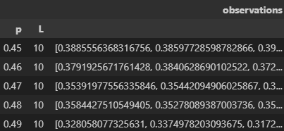
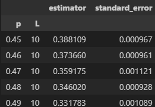
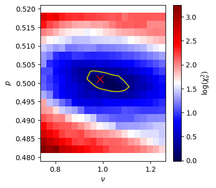
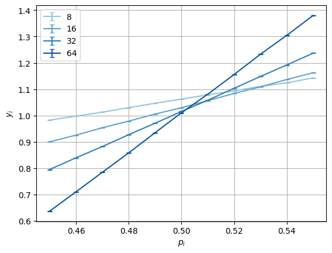
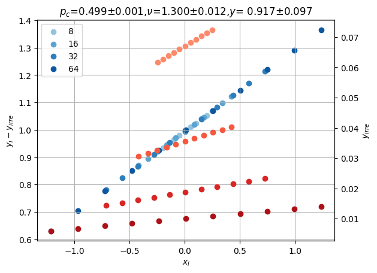

# FSS — Finite‑size scaling data collapse

Minimal, lmfit‑backed wrapper for estimating critical parameters via finite‑size scaling (FSS) and data collapse.

## Install
With `pip`:
```bash
pip install git+https://github.com/Pixley-Research-Group-in-CMT/FSS.git
```
With `uv`:
```bash
uv pip install git+https://github.com/Pixley-Research-Group-in-CMT/FSS.git
```

The wheel/SDist metadata declares all runtime dependencies (numpy, pandas, matplotlib, lmfit, tqdm).

## Data format
- pandas DataFrame with MultiIndex levels [p, L].
- One column: "observations"; each cell holds an array/list of samples for that (p, L).
- Example: index tuple (p=0.40, L=10) → observations: array([...]).


- Alternatively, the package accepts a dataframe with two columns `estimator` and `standard_error` to set the value directly to `self.y_i` and `self.d_i`. 
(This would be useful if the estimator is not a simple `mean`. For example, the estimator is variance or binder cumulant and standard error is obtained from bootstrapping)



Note that one needs to set `estimator='manual'` in `DataCollapse` to enable this.


## Quick start
```python
import numpy as np, pandas as pd
from fss import DataCollapse

# Build toy data
rng = np.random.default_rng(0)
p_list = np.round(np.linspace(0.45, 0.55, 11), 2)
L_list = np.arange(10, 20, 2)

data = {}
for L in L_list:
    for p in p_list:
        y = rng.normal(0.0, 0.01, 100)  # replace with your observable samples
        data[(p, L)] = y

index = pd.MultiIndex.from_tuples(list(data.keys()), names=["p", "L"]) 
df = pd.DataFrame({"observations": data.values()}, index=index)

# Collapse
dc = DataCollapse(df, p_="p", L_="L", params={}, p_range=[0.45, 0.55])
res = dc.datacollapse(p_c=0.501, nu=1.0, beta=0.0, p_c_vary=True, nu_vary=True, beta_vary=True)
print(res.params)
```

## Example figures
Synthetic parameters: $p_c=0.5$, $\nu=1.0$, $\beta=0.5$; $p\in[0.45,0.55]$ (11 points); $L\in\{10,12,14,16,18\}$; $f(x)=(1-x)^{1/2}$; noise $\epsilon=0.01$; $N=100$ samples. Recovered fit: $p_c,\nu,\beta$ close to truth.

| Raw data | Data collapse |
|:--------:|:-------------:|
|  |  |

### Finding good initial values

In some cases, the optimization landscape has many local minima—especially when the data is noisy or the scaling function is complex. The optimizer may get stuck or barely move from a poor starting point.

When this happens, a coarse grid search over the parameter space can help identify a good initial guess. By sweeping over ranges of $(p_c, \nu, \beta)$ and evaluating the reduced $\chi^2$ at each point, you can visualize where the global minimum lies and choose starting values that avoid local traps.

Usage:
```python
df=generate_pseudo_data(pc=0.5,nu=1,beta=0.0, epsilon=0.1)
dc=DataCollapse(df, p_='p',L_='L',params={},p_range=[0.45,0.55],)
result = dc.parameter_sweep(
    p_c=np.linspace(0.48, 0.52, 20),
    nu=np.linspace(0.75, 1.25, 20),
    beta=0,
    n_jobs=-1,  # use all cores
    backend='threading',  # multiprocessing
)
```
Output: 
```
p_c=0.5011, nu=0.9868, chi2=0.9882
p_c error=(0.4977, 0.5032), nu error=(0.9335, 1.1107)
```
with figure:
<p align="center">

</p>

The figure above shows the reduced $\chi^2$ as a function of $(p_c, \nu)$. The dark region indicates where the fit quality is best, guiding the choice of initial parameters for the nonlinear optimizer.
See `example.ipynb` for full code.

> **Note:** `parameter_sweep` only supports the basic data collapse (without scaling corrections). 

## Theory (finite‑size scaling)
For a continuous phase transition, an observable $y$ near the critical point $p_c$ obeys the scaling form

$$
y(p,L) \sim L^{-\beta/\nu} f((p-p_c) L^{1/\nu})
$$

where:
- $p$: tuning parameter; $L$: system size; $p_c$: critical point
- $\nu$: correlation‑length exponent; $\beta$: scaling exponent of $y$
- $f(\cdot)$: unknown universal scaling function

The collapse rescales

$$
x = (p-p_c) L^{1/\nu}, \quad y_{\text{scaled}} = y L^{\beta/\nu}
$$

and optimizes $p_c, \nu, \beta$ so that $y_{\text{scaled}}$ falls on a single curve $f(x)$.

More generally, for dynamical scaling $f(t / L^z)$: treat time $t$ as $p$, set $p_c=0$, and identify $z = -1/\nu$. Then

$$
(p-p_c) L^{1/\nu} \mapsto t L^{-z}
$$

so the mapping is direct.

## Scaling corrections for drifting crossings

Near criticality, finite-size corrections modify the scaling form:

$$
y(p, L) = \sum_{j_1=0}^{n_1} \sum_{j_2=0}^{n_2} a_{j_1 j_2} \cdot x^{j_1} \cdot L^{-y \cdot j_2}
$$

where:
- $x = (p - p_c) L^{1/\nu}$: relevant scaling variable
- $L^{-y}$: leading irrelevant correction (vanishes as $L \to \infty$)
- $y$: correction-to-scaling exponent
- $n_1$: polynomial order for the scaling function $f(x)$
- $n_2$: polynomial order for corrections ($n_2 = 0$ recovers standard scaling)
- $a_{j_1 j_2}$: Taylor coefficients (fitted via GLS)

The observable decomposes into:
- **Relevant part** (universal scaling function): $f(x) = \sum_{j_1=0}^{n_1} a_{j_1, 0} \, x^{j_1}$
- **Irrelevant part** (corrections): $\sum_{j_1, j_2 > 0} a_{j_1 j_2} \, x^{j_1} L^{-y j_2}$

Nonlinear parameters $(p_c, \nu, y)$ are optimized via `lmfit`; linear coefficients $a_{j_1 j_2}$ are solved analytically by Generalized Least Squares.

### Model selection

Use `grid_search` to scan over $(n_1, n_2)$ and `plot_chi2_ratio` to visualize:
- **Reduced chi-squared** $\chi^2_\nu$: should be $\approx 1$ (shaded cyan band shows $[0.5, 5]$)
- **Irrelevant contribution ratio**: fraction of variance explained by corrections; should be small ($< 10\%$, shaded orange)

Choose the smallest $(n_1, n_2)$ where $\chi^2_\nu \approx 1$ and irrelevant contribution is modest.

### Usage

```python
import numpy as np, pandas as pd
from fss import DataCollapse, grid_search, plot_chi2_ratio

# Generate dummy data with known parameters
# O = a00 + a10*x + (a01 + a11*x)*L^{-y}
# where x = (p - p_c) * L^{1/nu}
p_c_true, nu_true, y_true = 0.5, 1.3, 1.0
a_true = np.array([[1.0, 0.5],    # a00, a01
                   [0.3, 0.2]])   # a10, a11 (n1=1, linear)

rng = np.random.default_rng(0)
p_list = np.round(np.linspace(0.45, 0.55, 11), 2)
L_list = np.array([8, 16, 32, 64])  # wide range so L^{-y} varies 8x

data = {}
for L in L_list:
    for p in p_list:
        x = (p - p_c_true) * L ** (1 / nu_true)
        ir = L ** (-y_true)
        y_mean = sum(a_true[j1, j2] * x**j1 * ir**j2
                     for j1 in range(2) for j2 in range(2))
        data[(p, L)] = rng.normal(y_mean, 0.01, 100)

index = pd.MultiIndex.from_tuples(list(data.keys()), names=['p', 'L'])
df = pd.DataFrame({'observations': list(data.values())}, index=index)

# When n1, n2 are unknown, use grid search to find optimal model
model_dict = grid_search(
    n1_list=range(0, 4), n2_list=range(0, 3),
    p_c=0.5, nu=1.0, y=1.0,
    p_c_range=(0.45, 0.55), nu_range=(0.5, 2.0),
    df=df, p_='p', L_='L', params={}, p_range=[0.45, 0.55]
)

# Visualize to select optimal (n1, n2)
plot_chi2_ratio(model_dict)

# Select optimal model: smallest (n1, n2) with chi^2 ≈ 1
# Look for where solid lines enter the cyan band (chi^2 in [0.5, 5])
# and dashed lines are in orange band (irrelevant ratio < 10%)
optimal = min(
    ((n1, n2) for (n1, n2), dc in model_dict.items()
     if hasattr(dc, 'res') and 0.5 < dc.res.redchi < 5),
    key=lambda x: (x[1], x[0])  # prefer smaller n2, then smaller n1
)
print(f"Optimal model: n1={optimal[0]}, n2={optimal[1]}")

# Fit with optimal (n1, n2)
dc = model_dict[optimal]
print(dc.res.params)  # should recover p_c≈0.5, nu≈1.3, y≈1.0
dc.plot_data_collapse(drift=True, driftcollapse=True)
```

### Example figures
Synthetic parameters: $p_c=0.5$, $\nu=1.3$, $y=1.0$; $p\in[0.45,0.55]$ (11 points); $L\in\{8,16,32,64\}$; polynomial with $(n_1,n_2)=(1,1)$; noise $\epsilon=0.01$; $N=100$ samples. Recovered fit: $p_c,\nu,y$ close to truth.

| Raw data (drifting crossings) | Data collapse (irrelevant removed) |
|:-----------------------------:|:----------------------------------:|
|  |  |

## API

- `DataCollapse(df, p_, L_, params=None, p_range=[-0.1, 0.1], Lmin=None, Lmax=None, adaptive_func=None, estimator='mean')`
- `datacollapse(p_c=None, nu=None, beta=None, p_c_vary=True, nu_vary=True, beta_vary=False, ...)`
- `datacollapse_with_drift_GLS(n1, n2, p_c=None, nu=None, y=None, beta=0, ..._range, ..._vary)`
  - `n1`, `n2`: polynomial orders for scaling function and corrections
  - `beta`: order parameter exponent (default 0, set `beta_vary=True` to fit)
  - Returns `lmfit.MinimizerResult`; sets `self.y_i_minus_irrelevant`, `self.y_i_irrelevant`, `self.coeffs`
- `plot_data_collapse(...)`
- `grid_search(n1_list, n2_list, p_c, nu, y, p_c_range, nu_range, **kwargs)`
  - Scans polynomial orders; pass `DataCollapse` init kwargs (`df`, `p_`, `L_`, `params`, `p_range`, `Lmin`, `Lmax`)
  - Returns `dict[(n1, n2)] → DataCollapse`
- `plot_chi2_ratio(model_dict, L1=False)`
  - Plots $\chi^2_\nu$ (solid) and irrelevant ratio (dashed) vs $n_1$ for each $n_2$

Optimization is powered by lmfit; extra keyword arguments are passed through to `lmfit.minimize`.

Other utilities: `extrapolate_fitting`, `plot_extrapolate_fitting`, `optimal_df`, `bootstrapping`.

## Contributing

Contributions are welcome.

### Development Setup
For local development, clone the repo and install with dev dependencies:
```bash
git clone https://github.com/Pixley-Research-Group-in-CMT/FSS.git
cd FSS
pip install -e ".[dev]"
```

### Running Tests

```bash
pytest
```

### Issues

For bug reports, questions, or feature requests, please open an issue on GitHub.

### Pull Requests

1. Fork the repository
2. Create a branch for your changes
3. Ensure tests pass (`pytest`)
4. Submit a pull request

## License
BSD 3‑Clause License. You may use, modify, and redistribute the code (source or binary) provided you:
- retain the copyright notice, conditions, and disclaimer in source;
- reproduce them in binary distributions’ documentation/materials;
- do not use the authors’ or contributors’ names to endorse/promote derivatives without prior written permission.

Provided “AS IS” without warranties; see full text in `LICENSE`.

## TODO
- [ ] Better documentation (full API, examples)
- [x] Package-ify (standard Python package with pyproject.toml, versioning, wheels, etc.)
- [ ] Bootstrap method to estimate error bars (expose, document, examples)
- [ ] Zenodo DOI for releases
- [ ] Release to pypi index

## Contact
Author: Haining Pan — hnpan@terpmail.umd.edu
