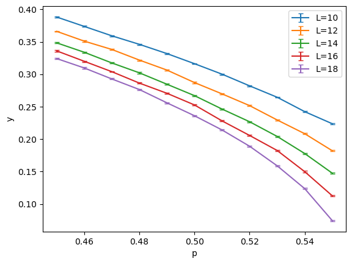
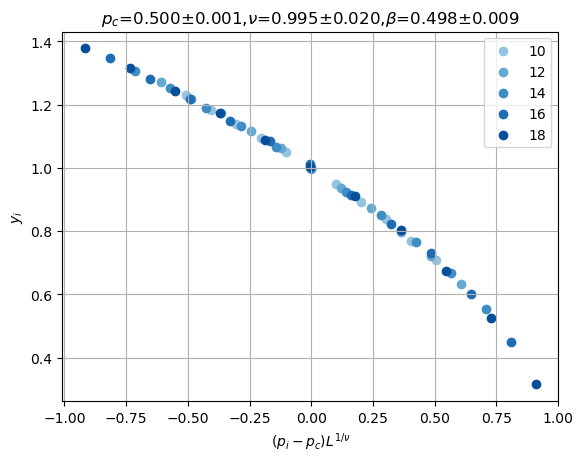

# FSS — Finite‑size scaling data collapse

Minimal, lmfit‑backed wrapper for estimating critical parameters via finite‑size scaling (FSS) and data collapse.

## Install
```bash
uv pip install git+https://github.com/Pixley-Research-Group-in-CMT/FSS.git
```
Alternatively, clone the repo and manually install
```bash
git clone https://github.com/Pixley-Research-Group-in-CMT/FSS.git
cd FSS
pip install .            # or: pip install -e . for editable installs
# uv users can skip cloning:
```

The wheel/SDist metadata declares all runtime dependencies (numpy, pandas, matplotlib, lmfit, tqdm).

## Data format
- pandas DataFrame with MultiIndex levels [p, L].
- One column: "observations"; each cell holds an array/list of samples for that (p, L).
- Example: index tuple (p=0.50, L=16) → observations: array([...]).

## Quick start
```python
import numpy as np, pandas as pd
from fss import DataCollapse

# Build toy data
rng = np.random.default_rng(0)
p_list = np.round(np.linspace(0.45, 0.55, 11), 2)
L_list = np.arange(10, 20, 2)

data = {}
for L in L_list:
    for p in p_list:
        y = rng.normal(0.0, 0.01, 100)  # replace with your observable samples
        data[(p, L)] = y

index = pd.MultiIndex.from_tuples(list(data.keys()), names=["p", "L"]) 
df = pd.DataFrame({"observations": data.values()}, index=index)

# Collapse
dc = DataCollapse(df, p_="p", L_="L", params={}, p_range=[0.45, 0.55])
res = dc.datacollapse(p_c=0.501, nu=1.0, beta=0.0, p_c_vary=True, nu_vary=True, beta_vary=True)
print(res.params)
```

## Example figures
Synthetic parameters: $p_c=0.5$, $\nu=1.0$, $\beta=0.5$; $p\in[0.45,0.55]$ (11 points); $L\in\{10,12,14,16,18\}$; $f(x)=(1-x)^{1/2}$; noise $\epsilon=0.01$; $N=100$ samples. Recovered fit: $p_c,\nu,\beta$ close to truth.

| Raw data | Data collapse |
|:--------:|:-------------:|
|  |  |

## Theory (finite‑size scaling)
At a continuous transition, an observable $y$ near the critical point $p_c$ obeys the scaling form

$$
y(p,L) \sim L^{-\beta/\nu} f((p-p_c) L^{1/\nu})
$$

where:
- $p$: tuning parameter; $L$: system size; $p_c$: critical point
- $\nu$: correlation‑length exponent; $\beta$: scaling exponent of $y$
- $f(\cdot)$: unknown universal scaling function

The collapse rescales

$$
x = (p-p_c) L^{1/\nu}, \quad y_{\text{scaled}} = y L^{\beta/\nu}
$$

and optimizes $p_c, \nu, \beta$ so that $y_{\text{scaled}}$ falls on a single curve $f(x)$.

More generally, for dynamical scaling $f(t / L^z)$: treat time $t$ as $p$, set $p_c=0$, and identify $z = -1/\nu$. Then

$$
(p-p_c) L^{1/\nu} \mapsto t L^{-z}
$$

so the mapping is direct.

## API (essentials)
- DataCollapse(df, p_, L_, params=None, p_range=[-0.1, 0.1], Lmin=None, Lmax=None, adaptive_func=None)
- datacollapse(p_c=None, nu=None, beta=None, p_c_vary=True, nu_vary=True, beta_vary=False, ...)
- plot_data_collapse(...)
- datacollapse_with_drift_GLS(n1, n2, p_c=None, nu=None, y=None, ...)

Optimization is powered by lmfit; extra keyword arguments are passed through to `lmfit.minimize`.

Other helper utilities exist (e.g., grid_search, plot_chi2_ratio, extrapolate_fitting, plot_extrapolate_fitting, optimal_df, bootstrapping) and will be documented.

## License
BSD 3‑Clause License. You may use, modify, and redistribute the code (source or binary) provided you:
- retain the copyright notice, conditions, and disclaimer in source;
- reproduce them in binary distributions’ documentation/materials;
- do not use the authors’ or contributors’ names to endorse/promote derivatives without prior written permission.

Provided “AS IS” without warranties; see full text in `LICENSE`.

## TODO
- [ ] Better documentation (full API, examples)
- [x] Package-ify (standard Python package with pyproject.toml, versioning, wheels, etc.)
- [ ] Bootstrap method to estimate error bars (expose, document, examples)

## Contact
Author: Haining Pan — hnpan@terpmail.umd.edu
